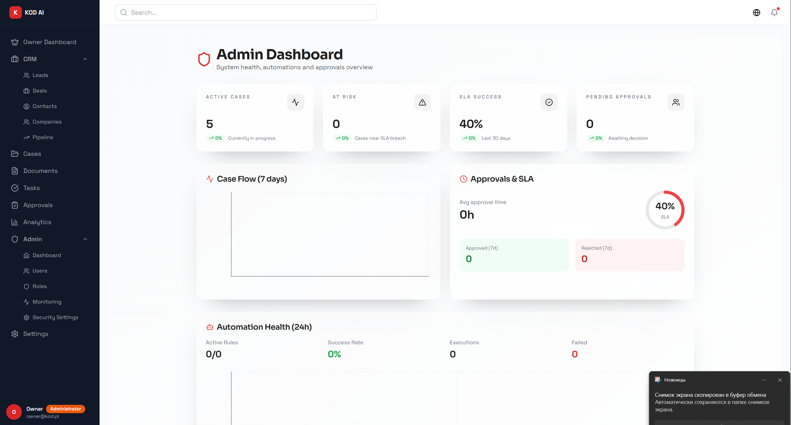
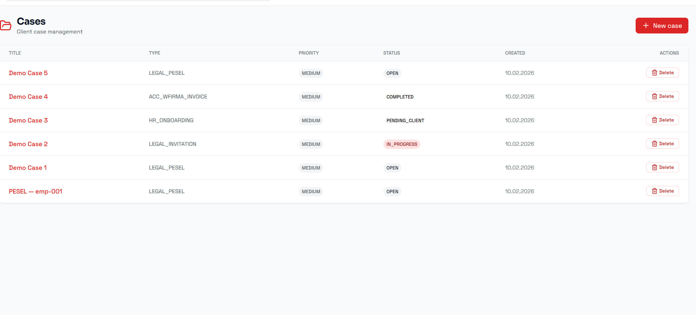
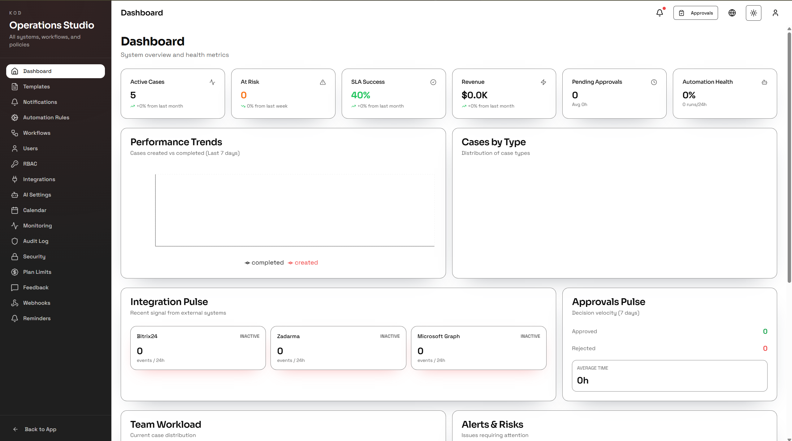
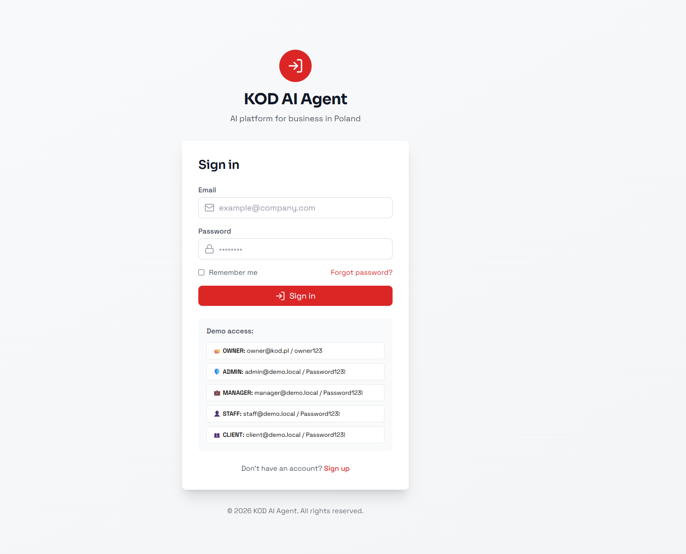

# AI Accounting CRM

CRM platform with AI-assisted workflows for accounting operations, case management, document handling and team workflow automation.

## Overview

AI Accounting CRM is a web-based business platform designed for accounting and operations teams.  
The system helps manage client cases, documents, approvals, users, roles and operational dashboards in one place.

The goal of the project is to reduce manual work, improve process visibility and support teams with AI-assisted workflows.

## Key Features

- Owner and admin dashboards
- Case management
- Document workflow structure
- User roles and permissions
- Approval flow
- CRM modules: leads, deals, contacts, companies and pipeline
- Analytics and operational metrics
- Integration monitoring
- Audit-oriented interface
- AI-assisted workflow concept

## Tech Stack

- Next.js
- React
- TypeScript
- Tailwind CSS
- Node.js
- PostgreSQL / Prisma
- AI integrations concept: OpenAI / Claude

## Screenshots

### Owner Dashboard

### Cases Management

### Operations Studio

### Sign In

## Project Scope

This project focuses on building a CRM-style internal platform for accounting-related workflows.  
It includes dashboards, case management, role-based areas, operational monitoring and AI-ready workflow architecture.

## My Role

- Full stack development
- UI implementation
- Dashboard structure
- CRM module architecture
- Workflow logic planning
- Admin and operations panel design
- AI-assisted process concept

## Notes

This repository is a public showcase version.  
Some production integrations, sensitive business logic and private configuration may be removed or simplified.

## Author

Bohdan Moskalenko  
Full Stack Developer focused on SaaS, CRM platforms, dashboards, AI-assisted systems and workflow automation.
